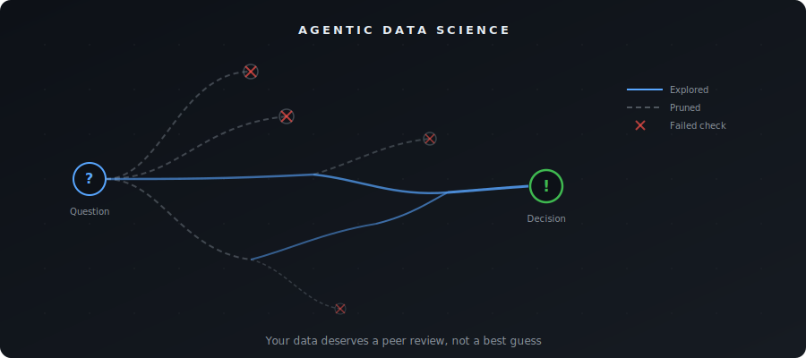
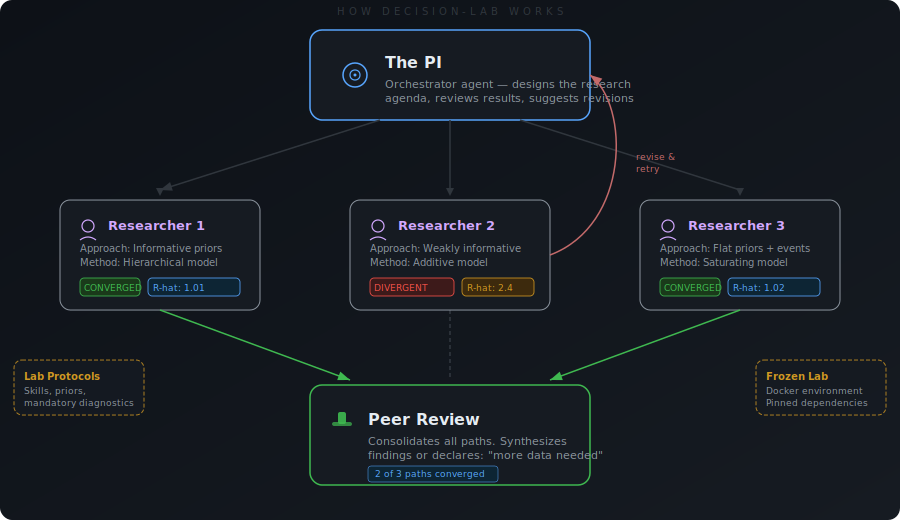

# decision-lab

### A framework for Agentic Data Science

*Your data deserves a peer review, not a dashboard.*

<p align="center">
  
</p>

Most AI data analysis works like one analyst pulling an all-nighter: pick one approach, run it, write up whatever comes out, hope for the best.

decision-lab works like a research lab. A **PI** agent designs the research plan. **Researcher** agents fan out to run parallel Bayesian causal experiments — different priors, different model structures, different hypotheses. Each reports back with diagnostics, not just results.

The PI reviews everything. Suggests revisions. Sends researchers back to try alternative approaches when results don't converge. When the evidence is strong, it synthesizes a recommendation. When the paths diverge irreconcilably, it says the thing no other AI tool will say: **"we can't tell from this data."**

Everyone's building agentic data science. decision-lab is the one rigorous enough to say no. We call this **Agentic Decision Science** — structured exploration of the analytical space, with the rigor to know when to stop.

## Why this exists

There are many ways to analyze a dataset. Most of them are wrong. An unsupervised agent picks one path through the analytical space and commits to it. If that path happens to be wrong, you get a nice-looking report with bad conclusions. Nobody notices for months.

We tested this on marketing mix modeling. We gave vanilla Claude Code and our MMM agent the same adversarial dataset where no valid inference was possible. **Claude Code fit a model and recommended budget reallocations.** Our agent tried 11 approaches, found that none of the models converged, said so, and recommended experiments to collect better data.

decision-lab (`dlab`) is the framework we built to make agents behave like that.

## How it works

<p align="center">
  
</p>

**The PI** (orchestrator agent) designs the research agenda, decomposes the question into parallel experiments, and decides when the evidence is sufficient — or when it isn't.

**The Researchers** (parallel subagents) each pursue a different analytical approach to the same problem. Different priors, different model structures, different data prep. They report back with full diagnostics: convergence checks, posterior predictive checks, sensitivity analyses. Supports running compute-heavy experiments in the cloud on [Modal](https://modal.com).

**Lab Protocols** (skills in a decision-pack) encode domain knowledge that prevents methodological mistakes — mandatory diagnostics, preferred model structures, informative priors. The equivalent of "read these papers before you touch the data."

**The Lab** (frozen Docker environment) ensures reproducible conditions. Library APIs change constantly and LLMs are trained on old versions. decision-packs lock the environment so the agent codes against the right API.

**The Peer Review** (consolidation) collates all decision paths. If the researchers converge on the same answer through different methods, that's a strong recommendation. If they diverge irreconcilably, the PI says so — because "the data doesn't support a decision" is better than a confident wrong one.

## Install

**Requires [Docker](https://docs.docker.com/get-docker/)** and Python 3.10+

```bash
pip install dlab-cli
```

## Quick start

```bash
# Run a decision-pack on your data
dlab --dpack dpacks/mmm --data ./marketing-spend.csv --prompt "Build a marketing mix model" --workdir ./analysis

# Watch it work
dlab connect ./analysis
```

Or build your own decision-pack. Ask Claude to scaffold one for you:

```bash
dhub install pymc-labs/decision-lab
claude
# > "Create a decision-pack for time series forecasting with statsforecast"
```

## What's a decision-pack?

A decision-pack bundles everything an agent needs into a portable directory: frozen environment, system prompts, domain skills, tools, and permissions. Think of it as the lab setup — equipment, protocols, and safety rules — before you start running experiments.

```
my-dpack/
  config.yaml           # Name, model, hooks
  docker/
    Dockerfile          # Frozen environment
    requirements.txt    # Pinned dependencies
  opencode/
    opencode.json       # Permissions
    agents/
      orchestrator.md   # The PI
    tools/              # Custom tools
    skills/             # Lab protocols
    parallel_agents/    # Researcher configs
```

See the [poem decision-pack](decision-packs/poem/) for a fully annotated example showing how all the pieces connect. Here's what happens when you run it:

```bash
dlab --dpack decision-packs/poem --env-file .env --prompt "Write me a poem about the ocean"
```

1. dlab builds the Docker image from [`docker/Dockerfile`](decision-packs/poem/docker/Dockerfile) (cached after first run)
2. The pre-run hook [`say_hi.sh`](decision-packs/poem/say_hi.sh) runs inside the container
3. The orchestrator ([`literary-agent.md`](decision-packs/poem/opencode/agents/literary-agent.md)) starts and calls POPO the terrible poet ([`popo-poet.md`](decision-packs/poem/opencode/agents/popo-poet.md)) via the `task` tool
4. The orchestrator reads POPO's poem, decides it's bad, and spawns 3 parallel poet instances ([`poet.md`](decision-packs/poem/opencode/agents/poet.md)) with different styles via the `parallel-agents` tool
5. Each instance writes `summary.md`. A consolidator (auto-generated from [`poet.yaml`](decision-packs/poem/opencode/parallel_agents/poet.yaml)) compares them
6. The orchestrator picks the best poem and writes `final_poem.md`
7. The post-run hook [`print_result.sh`](decision-packs/poem/print_result.sh) prints it to the terminal

The session directory ends up with parallel instance outputs, logs, and the final poem — all browsable with `dlab connect` or `dlab timeline`.

## Features

### Run sessions

```bash
dlab --dpack PATH --data PATH --prompt TEXT --env-file .env
```

Builds the Docker image (cached between runs), starts the container, runs pre-run hooks, launches the agent, runs post-run hooks, fixes file ownership, and stops the container. Sessions are auto-numbered (`analysis-001`, `analysis-002`, ...) and can be resumed with `--continue-dir`.

### Live monitoring

```bash
dlab connect ./analysis-001
```

A Textual TUI that shows live log events, agent status, cost tracking, and artifacts as the session runs. Browse between the orchestrator, parallel instances, and consolidator. Works with both running and completed sessions.

<!--  -->

### Execution timeline

```bash
dlab timeline ./analysis-001
```

Displays a Gantt chart of the session with timing, cost breakdown per agent, and idle periods. Shows the orchestrator, all parallel instances, and consolidators on a single timeline.

<!--  -->

### Creation wizards

```bash
dlab create-dpack              # Interactive wizard to scaffold a new decision-pack
dlab create-parallel-agent     # Wizard to add parallel agent configs to an existing decision-pack
```

The decision-pack wizard walks through 8 screens: name, container setup (package manager + base image), features (Decision Hub, Modal, Python library), model selection, permissions, directory skeletons, skill search, and review. Supports conda, pip, uv, and pixi.

<!--  -->

### Install as shortcut

```bash
dlab install ./my-dpack
# Now run directly:
my-dpack --data ./data --prompt "..."
```

Creates a wrapper script in `~/.local/bin/` so you can run a decision-pack by name instead of passing `--dpack` every time.

### Decision Hub integration

decision-packs work with [Decision Hub](https://hub.decision.ai), a registry of validated skills for data science and AI. Agents can search and install skills from the hub at runtime, giving them access to domain knowledge they weren't originally packaged with.

```bash
# Install the Decision Hub CLI as a skill in your decision-pack
dhub install pymc-labs/dhub-cli --agent opencode
```

The hub has 2,200+ skills from 38 organizations with automated evals that verify skills actually improve agent performance.

### Environment variable forwarding

All environment variables starting with `DLAB_` are automatically forwarded from the host to the Docker container. decision-packs use these for runtime configuration:

```bash
# MMM decision-pack: fit models locally instead of on Modal
DLAB_FIT_MODEL_LOCALLY=1 dlab --dpack mmm --data ./data --prompt "..."
```

## CLI reference

```bash
dlab --dpack PATH --data PATH --prompt TEXT   # Run a session
dlab connect WORK_DIR                         # Live TUI monitor
dlab timeline [WORK_DIR]                      # Execution Gantt chart
dlab create-dpack [OUTPUT_DIR]                # Interactive wizard
dlab create-parallel-agent [DPACK_DIR]        # Parallel agent wizard
dlab install DPACK_PATH                       # Create shortcut command
```

## Docs

| Guide | What it covers |
|-------|---------------|
| [CLI Reference](docs/cli-reference.md) | All commands, flags, env var forwarding |
| [decision-packs](docs/decision-packs.md) | Config format, hooks, permissions, Modal integration |
| [Parallel Agents](docs/parallel-agents.md) | Fan-out architecture, YAML config, consolidator |
| [Docker](docs/docker.md) | Image building, container lifecycle, volume mounts |
| [Sessions](docs/sessions.md) | Work directories, state management, resuming runs |
| [Log Processing](docs/log-processing.md) | NDJSON log format, event types, TUI/timeline parsing |
| [Installation](docs/installation.md) | Setup, prerequisites, development install |

## Built by PyMC Labs

decision-lab is developed by [PyMC Labs](https://www.pymc-labs.com), the team behind [PyMC](https://github.com/pymc-devs/pymc) and [pymc-marketing](https://github.com/pymc-labs/pymc-marketing).

## License

Apache 2.0
